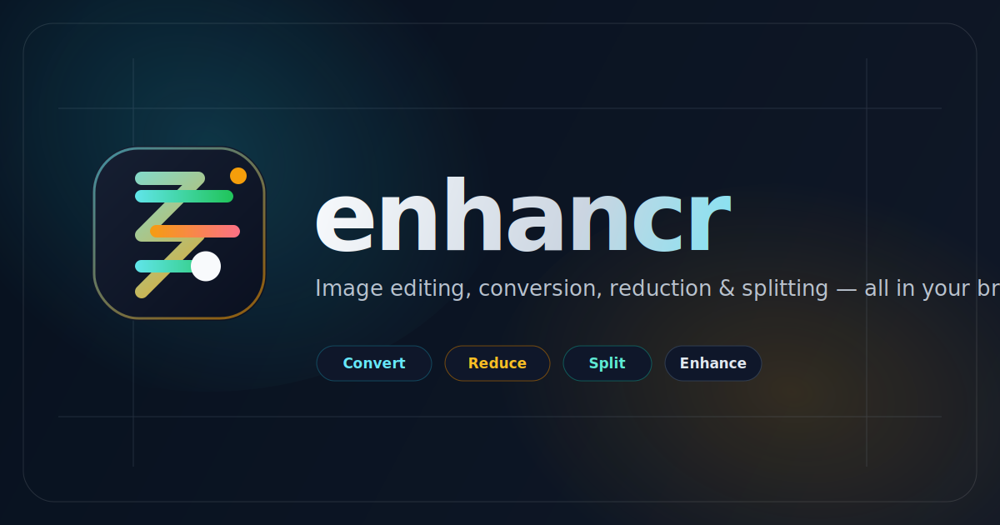
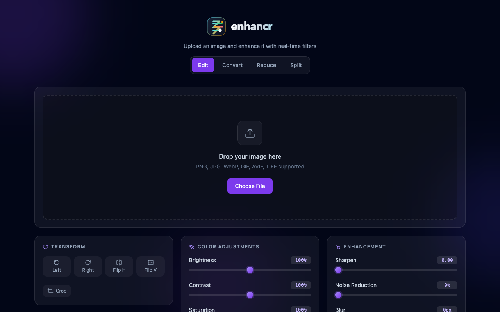
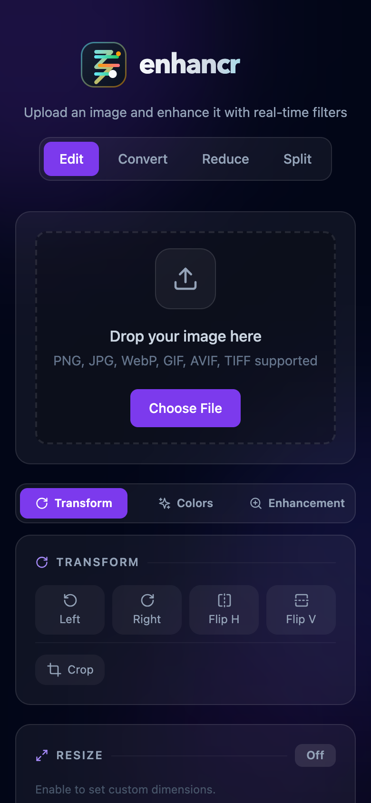

# Enhancr

  [](https://github.com/sponsors/viveknaskar)



A browser-based image editor with four dedicated modes — Edit, Convert, Reduce, and Split — all running locally in your browser with no uploads and no server.

**Live demo:** https://viveknaskar.github.io/enhancr/

---

## Screenshots

| Desktop | Mobile |
|---|---|
|  |  |

---

## Modes

| Mode | What it does |
|---|---|
| **Edit** | Full editing suite — color adjustments, enhancement filters, crop, resize, rotate, and flip |
| **Convert** | Convert an image to a different format (JPG, PNG, WebP, AVIF, TIFF) with one click |
| **Reduce** | Shrink file size by tuning format, quality, and dimensions together |
| **Split** | Divide an image into equal pieces (vertical, horizontal, or grid) with individual downloads |

---

## Features

| Category | Controls |
|---|---|
| Color Adjustments | Brightness, Contrast, Saturation, Sepia, Grayscale (0–200%) |
| Enhancement | Sharpen, Noise Reduction, Blur |
| Transform | Rotate 90° left/right, Flip horizontal/vertical |
| Crop | Interactive crop box with 8 handles and rule-of-thirds grid, works on touch screens |
| Resize | Custom dimensions (px or %), fit / stretch / crop modes, aspect ratio lock |
| Export | Format (Auto / JPG / PNG / WebP / AVIF / TIFF), JPEG quality, custom filename, background color |

- **Real-time preview** — filters, transforms, and crop overlay update instantly
- **Visual crop tool** — drag the crop box to position, drag handles to resize; the area outside the selection is dimmed and a live pixel-dimension label updates as you adjust
- **Touch & mobile support** — all crop handles and drag interactions work on touchscreens using pointer events
- **Mobile tabbed layout** — on small screens the adjustment panels switch to a tab bar (Transform / Colors / Enhancement) so the image and controls are both visible without scrolling
- **Per-control reset** — hover over any slider to reveal a ↺ button that resets just that control back to its default, without affecting anything else
- **Undo / Redo** — step back and forward through your edit history (Ctrl/Cmd+Z, Ctrl/Cmd+Shift+Z)
- **Noise reduction off the main thread** — runs in a Web Worker so the UI never freezes
- **Smart export format** — PNG/WebP/GIF/AVIF/TIFF inputs export as PNG (preserves transparency); JPEG inputs export as JPEG with adjustable quality
- **Drag and drop** — drop an image anywhere in the upload zone, or click to browse

## Getting Started

```bash
npm install
npm run dev
```

Open http://localhost:5173 in your browser.

## Usage

1. **Upload** — drag and drop an image or click the upload zone (JPEG, PNG, WebP, GIF, AVIF, TIFF)
2. **Pick a mode** — choose Edit, Convert, Reduce, or Split from the tab bar below the header
3. **Edit** — move the sliders to tune brightness, contrast, saturation, sharpness, noise reduction, and blur; hover any slider to reveal a ↺ reset button for that control
4. **Crop** — click **Crop** in the Transform panel, drag the handles to select a region (touch supported), then proceed to download
5. **Transform** — rotate or flip the image using the buttons in the Transform panel
6. **Resize** — enable resize, set target dimensions (px or %), and choose fit / stretch / crop mode
7. **Convert** — switch to Convert mode, pick the target format, and download
8. **Reduce** — switch to Reduce mode, adjust quality and dimensions to hit a smaller file size, then download
9. **Split** — switch to Split mode, choose rows/columns, and download all pieces at once
10. **Export** — choose format, set JPEG quality and background color if needed, enter a filename, then click **Download Image**

> On mobile, use the **Transform / Colors / Enhancement** tab bar below the image to switch between panels.

## Tech Stack

- [React 18](https://react.dev) + [TypeScript](https://www.typescriptlang.org)
- [Vite](https://vitejs.dev)
- [Tailwind CSS](https://tailwindcss.com)
- [Lucide React](https://lucide.dev) icons
- Canvas API for full-resolution, single-pass export (crop + resize + rotate + filter in one `drawImage` call)
- Web Workers API for off-thread noise reduction
- Pointer Events API for unified mouse and touch interaction

## Contributing

Contributions are welcome! Please read [CONTRIBUTING.md](CONTRIBUTING.md) for guidelines on reporting bugs, requesting features, and submitting pull requests.

## License

MIT © 2026 Vivek Naskar
